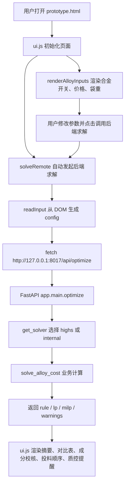
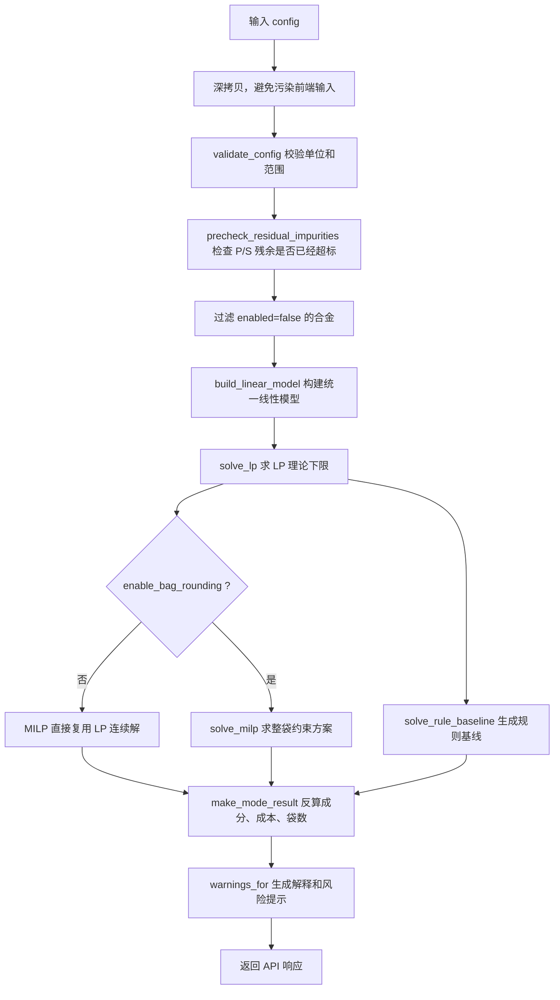

# 热卷合金成本计算系统说明

本文档按当前实际代码书写，用来说明这个系统到底有哪些文件、前后端如何协作、后端如何计算、结果为什么会出现 LP 与 MILP 一致等现象。

## 1. 当前系统一句话

这是一个本地运行的合金成本优化工具：

- 前端负责录入炉次、残余成分、目标成分、合金启用、价格、投料方式和袋重。
- 后端负责校验配置、构建数学模型、调用求解器、返回规则基线、LP、MILP 三类方案，并可直接托管前端静态文件。
- 当前唯一正式计算内核在后端，前端只负责读配置、提交输入和展示结果。

## 2. 当前文件分工

| 文件 | 作用 | 是否运行必需 |
|---|---|---|
| `prototype.html` | 页面结构、样式、初始静态展示。按钮调用 `requestSolveRemote()`，不加载旧离线求解器。 | 是 |
| `ui.js` | 前端交互逻辑：读取输入、从 `/config.json` 回填默认值、调用后端 `/api/optimize`、渲染结果。 | 是 |
| `config.json` | 默认炉次、目标成分、残余成分、合金成分、价格、回收率、安全余量、袋重设置，是单一事实源。 | 是 |
| `app/main.py` | FastAPI 入口，提供 `/health`、`/api/config`、`/api/optimize`，并托管前端静态文件与本地 CORS。 | 是 |
| `app/models.py` | API 请求/响应模型。 | 是 |
| `app/core.py` | 业务计算核心：校验、质量平衡、线性模型、规则基线、结果组装、提示信息。 | 是 |
| `app/solvers/base.py` | 求解器接口定义。 | 是 |
| `app/solvers/factory.py` | 根据 `solver` 名称选择求解器。 | 是 |
| `app/solvers/highs.py` | SciPy/HiGHS 求解器，实际负责 LP 和 MILP。 | 是 |
| `app/solvers/internal.py` | 无外部依赖兜底求解器，用于测试对照和降级，不是首选生产求解器。 | 是 |
| `requirements.txt` | Python 后端依赖。 | 是 |
| `tests/test_backend_optimizer.py` | 后端、API、求解逻辑、提示逻辑测试。 | 测试必需 |
| `tests/ui_static.test.js` | 前端静态结构和前后端请求契约测试。 | 测试必需 |
| `CLAUDE.md` | 给后续 agent 的项目速查说明。 | 维护必需 |
| `DESIGN.md` | UI 设计风格参考。 | 参考资料 |
| `cites/` | PPT、参考意见、截图等原始依据。 | 参考资料 |
| `热卷合金消耗与合金成本计算(1).pptx` | 原始 PPT 资料。 | 参考资料 |

已删除的旧文件：

| 文件 | 删除原因 |
|---|---|
| `alloy_optimizer.js` | 旧浏览器/Node 离线求解器。前端已改为调用 FastAPI 后端，保留它会造成“双内核”误解。 |
| `tests/alloy_optimizer.test.js` | 旧离线求解器测试。关键业务断言已迁移到 `tests/test_backend_optimizer.py`。 |
| `glimmering-foraging-fox.md` | 早期方案草稿，写的是旧 Python 单文件计划，和当前 FastAPI 架构不一致。 |

## 3. 运行方式

后端：

```bash
. .venv/bin/activate
uvicorn app.main:app --host 127.0.0.1 --port 8017
```

前端：

```bash
python3 -m http.server 8018 --bind 127.0.0.1
```

访问：

```text
http://127.0.0.1:8018/prototype.html
```

后端健康检查：

```text
http://127.0.0.1:8017/health
```

## 4. 前后端完整调用链



前端当前固定发送：

| 字段 | 当前值 |
|---|---|
| URL | `http://127.0.0.1:8017/api/optimize` |
| method | `POST` |
| solver | `highs` |
| body | `{ solver: "highs", config: 当前页面输入 }` |

后端只允许本地前端来源跨域访问：

| 来源 | 是否允许 |
|---|---|
| `http://127.0.0.1:8018` | 允许 |
| `http://localhost:8018` | 允许 |
| 其他来源 | 当前未开放 |

## 5. 当前输入配置结构

`config.json` 是系统默认配置，也是唯一事实源。前端 `ui.js` 不再内嵌默认配置，而是通过 `/config.json` 回填页面输入。测试会检查页面输入和后端配置是同一份事实，而不是两套各说各话的影子配置。

主要字段：

| 字段 | 含义 |
|---|---|
| `heat_weight_t` | 炉次重量，单位 t。 |
| `recovery_rates` | 元素默认回收率。 |
| `safety_margins` | 安全余量，用来把目标范围收窄。 |
| `alloys` | 可用合金列表。 |
| `target` | 目标成分范围，单位 `%`。 |
| `control_targets` | 控 Si/C 单值上限；启用后该元素取消下限，只保留扣除控元素安全余量后的上限。 |
| `residual` | 钢水残余成分，单位 `%`。 |
| `milp_settings.enable_bag_rounding` | 是否启用整袋 MILP 约束。 |

每种合金的关键字段：

| 字段 | 含义 |
|---|---|
| `name` | 合金名称。 |
| `price_per_ton` | 合金价格，单位 元/t。 |
| `composition` | 合金成分，单位 `%`。例如 `Mn=65.66` 表示 65.66%。 |
| `enabled` | 是否参与本次计算。 |
| `addition_sequence` | 规则基线兜底贪心时的投料顺序。 |
| `bag_size_kg` | 袋重。大于 0 时按整数袋约束；等于 0 时连续投料。 |
| `max_add_kg_per_t` | 每吨钢最大允许加入量。 |
| `recovery_overrides` | 单个合金对某元素的回收率覆盖。 |

## 6. 当前覆盖和未覆盖的元素

当前后端实际参与计算的元素只有：

| 元素 | 状态 |
|---|---|
| C | 已覆盖 |
| Si | 已覆盖 |
| Mn | 已覆盖 |
| Cr | 已覆盖 |
| P | 已覆盖，仅上限为主 |
| S | 已覆盖，仅上限为主 |

当前未覆盖：

| 元素 | 状态 |
|---|---|
| V | 未进入 `ELEMENTS`，未参与计算 |
| Nb | 未进入 `ELEMENTS`，未参与计算 |
| Ti | 未进入 `ELEMENTS`，未参与计算 |
| Ni | 未进入 `ELEMENTS`，未参与计算 |
| Cu | 未进入 `ELEMENTS`，未参与计算 |
| Mo | 未进入 `ELEMENTS`，未参与计算 |
| B | 未进入 `ELEMENTS`，未参与计算 |
| Sb | 未进入 `ELEMENTS`，未参与计算 |

所以，PPT 中“钒铁等单一因素影响类合金计算”目前没有作为独立模块实现。它的质量平衡形式和现有模型兼容，但当前配置和代码没有把这些元素、合金、目标、残余和回收率接入。

## 7. 计算逻辑总览



## 8. 配置校验逻辑

后端在求解前先校验配置，错误配置不会进入求解器。

主要校验：

| 校验项 | 目的 |
---|---|
| 炉重 1~500 t | 防止单位错或空值。 |
| 回收率 0~1.2 | 防止明显错误。 |
| 安全余量 0~0.5 | 防止把目标范围收窄到离谱。 |
| 目标成分 0~10% | 防止百分数和小数写错。 |
| 目标下限不能大于上限 | 防止无意义约束。 |
| 合金价格 100~200000 元/t | 防止价格单位错。 |
| 袋重 0~2000 kg | 防止袋重单位错。 |
| 最大加入量 0~200 kg/t | 防止加入量单位错。 |
| Si/Mn/Cr 成分大于 0 且小于 1 时报警 | 防止把 `65.66%` 写成 `0.6566`。 |

禁用合金不参与这些合金成分校验。这样做的原因是：禁用合金的数据即使脏，也不应该影响当前求解。

## 9. P/S 残余超标预检查

P、S 与 C/Si/Mn/Cr 不同。加合金通常不能降低 P/S，只会引入或保持杂质风险。

所以后端在求解前检查：

| 情况 | 处理 |
|---|---|
| `residual.P > target.P.max` | 直接报错，不求解。 |
| `residual.S > target.S.max` | 直接报错，不求解。 |

这不是求解器问题，是工艺问题。继续优化会输出看起来很精确、实际没意义的垃圾结果。

## 10. 质量平衡公式

当前系统统一使用一个元素增量公式：

```text
元素增量 = 合金加入量 × 合金中该元素百分数 × 回收率 / 1000
```

单位解释：

| 项 | 单位 | 示例 |
|---|---|---|
| 合金加入量 | kg/t | 10 kg/t |
| 合金中该元素百分数 | % | Mn = 65.66 |
| 回收率 | 无量纲 | 0.98 |
| 元素增量 | 最终钢水成分百分点 | 0.643% |

示例：

```text
10 × 65.66 × 0.98 / 1000 = 0.643%
```

注意：这里不是 `/10000`，也不是页面旧草稿里曾经写过的 `/10`。

## 11. 有效目标范围

用户输入的是目标范围，但求解时使用的是“扣除安全余量后的有效范围”。

| 边界 | 实际使用方式 |
|---|---|
| 有下限的元素 | `有效下限 = 目标下限 + low safety margin` |
| 有上限的元素 | `有效上限 = 目标上限 - high safety margin` |
| 启用控元素 | `有效上限 = 控制单值 - control_targets.margin`，且不生成下限约束 |

举例：

| 元素 | 原始目标 | 安全余量 | 有效范围 |
|---|---|---|---|
| Mn | 1.10~1.30 | low=0.010, high=0.010 | 1.110~1.290 |
| P | max=0.025 | high=0.002 | max=0.023 |

## 12. 线性模型如何构建

后端把所有启用合金和所有已覆盖元素转换成一个线性规划模型。

目标：

```text
最小化吨钢合金成本
```

成本系数：

```text
合金价格 元/t ÷ 1000 = 元/kg
```

每个元素生成约束：

| 目标边界 | 约束含义 |
---|---|
| 有上限 | 所有合金带来的元素增量不能让最终成分超过有效上限。 |
| 有下限 | 所有合金带来的元素增量必须让最终成分达到有效下限。 |

每种合金还有自身加入量上限：

```text
0 <= 合金 kg/t <= max_add_kg_per_t
```

## 13. 三种方案分别是什么

### 13.1 LP 理论下限

LP 把所有合金加入量都当成连续变量。

含义：

| 项 | 说明 |
|---|---|
| 目标 | 成本最低 |
| 变量 | 每种合金 kg/t，可以是任意小数 |
| 用途 | 看理论最低成本 |
| 局限 | 不一定能现场直接投料，因为袋装合金不能投 3.217 袋 |

当前默认求解器：

| solver | 实现 |
|---|---|
| `highs` | `scipy.optimize.linprog(method="highs")` |
| `internal` | 顶点枚举小规模 LP |

### 13.2 MILP 现场方案

MILP 在 LP 的基础上处理整袋合金。

规则：

| 合金设置 | MILP 变量 |
|---|---|
| `bag_size_kg = 0` | 连续 kg/t |
| `bag_size_kg > 0` | 整数袋数 |

换算：

```text
kg/t = 袋数 × bag_size_kg / heat_weight_t
```

当前默认求解器：

| solver | 实现 |
|---|---|
| `highs` | `scipy.optimize.milp` |
| `internal` | 分支定界，袋装合金整数化 |

### 13.3 规则基线

规则基线不是 PPT 公式的逐条复刻，也不是现场历史真实投料。

当前实际逻辑：

1. 先筛出低碳保守合金：合金自身 C 含量 `<= 5%`。
2. 用这些低碳保守合金跑一次 MILP。
3. 如果这个保守 MILP 可行，就把它作为规则基线。
4. 如果不可行，再按 `addition_sequence` 排序做顺序贪心兜底。
5. 贪心每一步只补当前最缺的 `Cr, Si, Mn, C`，同时不能超过元素上限。

这就是为什么页面和 API 都提示：

```text
规则基线是系统按保守规则生成的对照方案，不等于现场历史真实投料。
```

## 14. 规则基线和 PPT 公式的关系

PPT 里的公式是手写顺序公式。例如高碳铬铁计算会使用目标碳、终点碳、硅铁理论增碳、中碳锰铁理论增碳、固定碳余量、目标铬等嵌套 IF。

当前代码没有逐条复刻这些 IF 公式。

差异如下：

| 项 | PPT 公式 | 当前系统 |
|---|---|---|
| 计算方式 | 按合金顺序写死 IF 公式 | 统一质量平衡 + 线性优化 |
| 高碳铬铁 | 使用固定碳余量、目标铬、嵌套 IF | 作为可选合金进入全局约束 |
| 低碳铬铁 | 根据高碳铬铁增铬量再补铬 | 作为可选合金进入全局约束 |
| 硅锰/锰铁/硅铁 | 按顺序扣理论影响 | 所有合金同时参与成本最小化 |
| 规则基线 | PPT 原始人工规则 | 当前低碳保守 MILP + 贪心兜底 |
| 单一元素合金 | PPT 有 V/Nb/Ti/Ni 等公式 | 当前未实现 |

如果需要严格对齐 PPT，应该新增一个独立方案：

```text
ppt_rule：PPT 原公式复刻方案
```

不要把它混进当前 `rule`。混进去会让“规则基线”既像优化器又像 PPT，后面一定说不清。

## 15. LP 和 MILP 为什么有时一样

这不是 bug。

有四种情况：

| 情况 | 结果 |
|---|---|
| 所有合金都是连续投料 | MILP 没有整数变量，会退化为 LP。 |
| `enable_bag_rounding=false` | MILP 直接复用 LP 连续解。 |
| 有整袋合金，但 LP 解刚好满足袋重步长 | LP 和 MILP 一致。 |
| 有整袋合金，LP 解不满足袋重步长 | MILP 会调整投料，成本可能高于 LP。 |

这些解释由后端 `warnings` 动态生成，前端在“质控提醒”区域展示。

## 15.1 控 Si / 控 C 如何进入 LP 和 MILP

控 Si/C 不改变求解器，也不改变 LP/MILP 算法。它只改变 `effective_bounds()` 返回给 `build_linear_model()` 的有效边界。

启用控元素后：

```text
min = None
max = control_targets.elements[E].value - control_targets.margin
```

所以 `build_linear_model()` 只会生成一条上限约束：

```text
residual_E + ΣΔE_i <= control_E - control_margin
```

不会再生成：

```text
residual_E + ΣΔE_i >= target_min_E
```

这意味着控 Si 或控 C 是“别超过这个值”，不是“尽量命中这个值”。如果 C 只控上限，求解器为了省钱让 C 低于原 `target.C.min` 是正常结果，不是 bug。

## 16. 返回结果如何渲染

后端返回结果后，前端渲染五块内容：

| 页面区域 | 数据来源 |
|---|---|
| 顶部推荐方案摘要 | `result.modes.milp` |
| 关键指标卡片 | MILP 成本、规则基线差异、总加入量、碳余量 |
| 三方案对比表 | `rule / lp / milp` 每种合金 kg/t 和总成本 |
| 成分校核 | 当前选中方案的 `chemistryChecks` |
| 加入顺序 | 当前选中方案中 `kgPerTon > 0` 的合金，按 `sequence` 排序 |
| 质控提醒 | 后端 `warnings` |

“比规则基线省/增”的含义：

```text
(当前方案成本 - 规则基线成本) / 规则基线成本 × 100%
```

负数表示比规则基线便宜；正数表示比规则基线更贵。

## 17. 当前 API

### GET `/health`

用途：检查后端是否启动。

返回：

```text
status = ok
service = alloy-cost-calculation
```

### POST `/api/optimize`

用途：根据配置求解。

请求字段：

| 字段 | 说明 |
|---|---|
| `config` | 当前求解配置。 |
| `solver` | 可选，默认 `highs`。 |

当前 solver：

| solver | 状态 |
|---|---|
| `highs` | 默认正式求解器 |
| `scipy` | `highs` 的别名 |
| `internal` | 兜底求解器 |
| `ortools` | 预留，未接入 |
| `gurobi/cplex` | 未接入 |

响应状态：

| status | 含义 |
|---|---|
| `ok` | 三方案成功返回。 |
| `infeasible` | 无可行解，返回诊断。 |
| `not_proven` | 内部分支定界达到节点上限，未证明最优。 |

## 18. 当前没做的事

这些不是隐藏功能，而是真的没实现：

| 功能 | 状态 |
|---|---|
| V/Nb/Ti/Ni/Cu/Mo/B/Sb 单一元素合金 | 未实现 |
| PPT 每条 IF 公式 1:1 复刻 | 未实现 |
| OR-Tools 求解器 | 预留但未实现 |
| Gurobi/Cplex 商业求解器 | 未实现 |
| 温降模型 | 配置里有开关，但当前禁用 |
| 多钢种数据库 | 未实现 |
| 用户保存方案 | 未实现 |
| 后端托管前端静态文件 | 已实现；开发期仍可用独立静态服务，但不是唯一入口 |

## 19. 维护原则

1. 不要再恢复浏览器离线求解器。否则会出现前端一套结果、后端一套结果。
2. 新元素必须同时扩展 `ELEMENTS`、`config.json`、前端默认配置、测试和页面展示。
3. 新求解器只能接入 `app/solvers/`，业务逻辑不要直接依赖某个求解器库。
4. 如果要复刻 PPT 原公式，新增 `ppt_rule`，不要污染当前 `rule`。
5. 所有“为什么结果一样/为什么不可行”的解释应由后端 warnings 返回，前端只展示。

## 20. 实际模型到底在算什么

先把话说死：这不是“经验公式计算器”，也不是“把 PPT 表格翻译成网页”。当前代码的本体是一个带工艺边界的线性优化问题。

### 20.1 决策变量

对每种启用合金 `i`，决策变量是每吨钢加入量 `x_i`，单位是 `kg/t`。

```text
minimize   Σ (price_i / 1000) * x_i
```

这里 `price_i` 是 `元/t`，除以 `1000` 后变成 `元/kg`，再乘 `kg/t` 得到 `元/t`。

### 20.2 元素平衡

每种合金对每个元素 `e` 的贡献系数是：

```text
coeff(i, e) = composition(i, e) * recovery_rate(e) / 1000
```

如果合金自己的 `recovery_overrides` 覆盖了某元素，就优先用覆盖值；否则用全局 `recovery_rates`。

最终钢水成分是：

```text
final(e) = residual(e) + Σ coeff(i, e) * x_i
```

这条公式就是系统的物理核心，没有别的花活。

### 20.3 约束如何落到线性模型

目标边界不是直接拿来求解，而是先过一层安全余量：

```text
effective_min = target.min + safety_margins.low
effective_max = target.max - safety_margins.high
```

然后变成线性不等式：

```text
residual(e) + Σ coeff(i, e) * x_i <= effective_max(e)
residual(e) + Σ coeff(i, e) * x_i >= effective_min(e)
```

在求解器里，下限会被改写成 `-A x <= -b`，这样 LP/MILP 能统一处理。

每种合金还有自己的投加上限：

```text
0 <= x_i <= max_add_kg_per_t
```

这不是“建议值”，是硬边界。

如果元素启用了 `control_targets`，有效边界会改成只含上限：

```text
final(e) <= control_value(e) - control_targets.margin
```

这条约束和普通上限一样进入 LP/MILP；求解器并不知道“控 Si”这个词，它只看到一条线性不等式。

### 20.4 LP、MILP、规则基线分别干什么

`lp` 是连续变量解，含义是理论最低成本。它告诉你“如果投料可以无限细分，最低能到哪里”。

`milp` 是现场可执行解。`bag_size_kg > 0` 的合金必须按整袋来，换算后变量步长是：

```text
step_i = bag_size_kg / heat_weight_t
```

所以整数袋变量实际要求：

```text
x_i = k_i * step_i,  k_i ∈ Z>=0
```

`bag_size_kg = 0` 的合金保持连续。

`rule` 不是“真实历史经验”的复刻，更不是全局最优。它只是系统生成的对照方案：

1. 先筛出低碳保守合金，也就是 `C <= 5%` 的那些。
2. 能跑就先跑一遍保守 MILP。
3. 保守 MILP 不可行时，再按 `addition_sequence` 做贪心兜底。
4. 贪心只优先补 `Cr, Si, Mn, C` 中当前最缺的元素。
5. 每一步都要过上限检查，不能把某个元素顶爆。

这就是为什么 `rule` 只能当对照，不该被包装成现场真相。

### 20.5 结果是怎么被重新整理的

求解器吐出来的是原始变量向量，`make_mode_result()` 会再做一次面向展示的整理：

- 负数和极小值会被压成 `0`。
- 对于有袋重的合金，展示值会按袋重重新取整，方便现场直接看袋数。
- 然后重新反算成分、成本和每种合金的炉次用量。

这件事很实用，但也意味着：展示列里的 `lp` 不一定是“数学上原封不动的 LP 原值”，而是“已经按现场颗粒度整理过的可读结果”。别把这个细节看漏了，不然你会以为模型在自打脸。

### 20.6 什么时候说成功，什么时候说失败

`solve_alloy_cost()` 的返回状态只有三类：

| 状态 | 含义 |
|---|---|
| `ok` | LP、MILP、规则基线都算出来了。 |
| `infeasible` | 约束本身就没解，或者 LP/MILP 无法满足。 |
| `not_proven` | MILP 搜索到可行解了，但节点上限到了，没证明全局最优。 |

这三个状态别混。混了就是把工程问题说成数学废话。

## 21. 业务逻辑的真实边界

### 21.1 先校验，再计算

`validate_config()` 不是装饰品，里面的校验是为了在求解前把脏输入打死：

- 炉重必须在 `1~500 t`。
- 回收率必须在 `0~1.2`。
- 安全余量必须在 `0~0.5`，而且大于 `0.1` 会额外报警，防止单位错。
- 目标成分必须在 `0~10%`，避免把百分数写成小数。
- 合金价格、袋重、最大加入量都有限幅，超了就说明单位可能错了。
- `Si/Mn/Cr` 如果落在 `0~1` 之间，代码会怀疑你把 `65.66%` 写成了 `0.6566`。

还有一个很关键的坑被单独堵住了：空字符串不能当 0。这个约束是对的，不然现场录入空值会被 JS 式宽松转换悄悄吞掉。

### 21.2 P/S 为什么单独处理

`P` 和 `S` 跟 `C/Si/Mn/Cr` 不一样。加合金可以抬高它们，不能靠“多加一点”把它们降下来。

所以代码在求解前直接检查：

- `residual.P > target.P.max` 就报错。
- `residual.S > target.S.max` 就报错。

这不是求解器无能，是工艺事实。继续算下去只会得到一坨看起来很精确的幻觉。

### 21.3 禁用合金的语义

`enabled=false` 的合金会被从求解集合里过滤掉。

这条语义很重要：

- 它不参与求解。
- 它也不参与针对当前启用集合的合金校验。
- 它的数据可以脏，因为它当前根本不该影响结果。

这比“所有数据都一视同仁”更合理。后者看似严谨，实际是在把不可用数据硬塞进关键路径。

### 21.4 无可行解是怎么解释的

`diagnose_infeasible()` 会先做非常朴素的上限估算：

- 看每个元素的残余加上所有启用合金最大投加后，能不能达到下限。
- 看残余本身是不是已经超了上限。

如果没抓到明确原因，就返回一条总诊断，提示去检查 `C` 上限、`Mn/Cr` 下限和启用合金组合。

这说明系统不是“黑箱报错”，而是在尽量把不可行原因说人话。

### 21.5 规则、LP、MILP 的关系

后端会给出三列结果，但它们不是同一层东西：

- `rule` 是保守对照。
- `lp` 是理论下界。
- `milp` 是现场可执行方案。

前端默认把 `milp` 当推荐方案，是对的。现场要的是能投，不是漂亮的连续小数。

### 21.6 为什么会出现 LP 和 MILP 一样

这不是 bug，常见有四种原因：

- 所有启用合金都没有袋重，MILP 退化成 LP。
- `milp_settings.enable_bag_rounding=false`，那就是故意让 MILP 复用 LP。
- LP 解刚好落在袋重步长上。
- LP 和 MILP 的投料组合不同，但成本一样，属于同成本替代解。

系统会把这些情况写进 `warnings`，别让用户误判模型坏了。

## 22. 现在最该警惕的地方

### 22.1 不是所有“看起来能算”的东西都真的有物理意义

`temperature_drop.enabled` 现在只会影响提示，不会进入真实求解链路。也就是说，它还不是一个真正参与优化的子模型。

### 22.2 规则基线不是历史真值

`rule` 是系统构造出来的保守对照，不是现场师傅过去三年真的这么投的。

如果后面你要做知识沉淀，别拿它冒充历史记录。该单独建历史数据层的时候就得建，别偷懒。

### 22.3 展示层会做一次袋重整理

这是最容易被忽略的边界：

- 数学模型里有连续解。
- 展示层又会把有袋重的合金按袋重重新取整。

这样做对现场友好，但你在分析 LP/MILP 差异时必须记住它。否则你会把“展示后的方案”误当成“原始优化器输出”。

### 22.4 下一步如果要继续做，优先级应该是

1. 把实际炉次化验数据接进来，别再依赖默认残余值。
2. 如果要复刻 PPT 的手写公式，单独加 `ppt_rule`，不要污染当前优化模型。
3. 如果要做更强的现场约束，再加工艺层，而不是在 `rule` 里硬塞 if/else。
4. 如果要做多钢种或多工艺扩展，先抽数据结构，再谈新功能。
