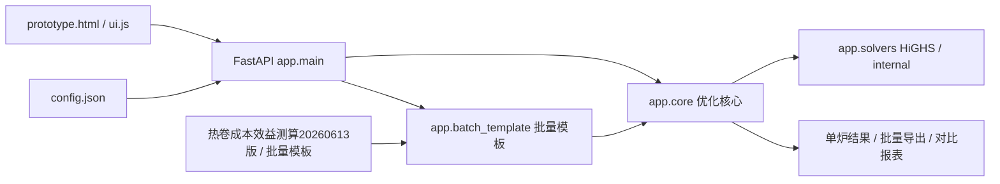
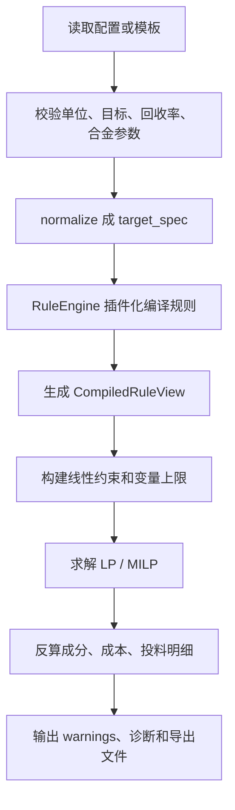

# 热卷合金成本优化工具

## 需求与目标

本项目用于热卷炼钢合金化成本优化：根据炼钢牌号、目标成分、转炉终点成分、回收率、合金成分和价格，计算满足成分约束下的低成本合金投料方案，并把旧 Excel 规则、LP 理论下限、现场可执行约束和批量模板流程统一到一个后端内核。

当前重点目标：

- 保留 `热卷成本效益测算20260613版（基础参数表）---发徐老师(3).xlsx` 作为当前正确版旧规则取证和结果对比来源。
- 用后端 LP/MILP 算法替代旧 Excel 的逐列启发式公式。
- 把现场确认的新 LP 工艺规则集中到 `process_rules`，并支持页面配置。
- 批量 Excel 模板可预检、批量计算、导出结果。
- 对关键回算任务生成可审计 workbook，给出来源、结果、差异和原因。

## 开发环境

- 操作系统：Windows。
- Python：项目虚拟环境 `.venv-win`。
- 后端依赖：FastAPI、Pydantic、NumPy、SciPy/HiGHS、openpyxl。
- 前端：原生 HTML/CSS/JavaScript。
- 测试：pytest、Node.js `node --test`。

常用命令：

```powershell
.venv-win\Scripts\python.exe -m pytest -q
node --test tests/ui_static.test.js
.venv-win\Scripts\uvicorn.exe app.main:app --host 127.0.0.1 --port 8017
```

访问页面：

```text
http://127.0.0.1:8017/prototype.html
```

## 技术架构



核心数据流：



## 功能逻辑

### 单炉计算

用户在页面录入或调整目标成分、残余成分、合金价格、投料方式、回收率和现场工艺规则。后端返回：

- `rule`：系统生成的规则基线，只作为对照，不代表现场历史真实投料。
- `lp`：连续变量理论最低成本。
- `milp`：考虑整袋投料后的现场方案。

### 批量模板

批量模板包含任务、目标成分、转炉终点与回收率、合金成分库、价格表、填写说明，以及可编辑的 `07_工艺规则参数`。上传后先读取 `config.json` 默认规则，再用模板参数覆盖，覆盖完成后预检和逐任务求解。旧模板如果没有 `07_工艺规则参数`，当前仍兼容，默认回落到系统规则。

`01_批量任务` 支持逐炉填写 `手工铝块kg/t`。该字段只用于现场铝块的实际用量补录和审计展示，不参与 LP 自动优化，也不计入最终合金成本和最终合金消耗。批量导出仍会显示 `手工铝块kg/t`、`手工铝块成本元/t` 和“手工录入”路线明细，但 `总吨钢成本`、`总合金消耗kg/t`、`炉次总成本` 均保持自动 LP/MILP 口径，不叠加手工铝块。空值或 `0` 表示本炉没有手工铝块记录。为了能展示参考成本，`04_合金成分库` 和 `05_价格表` 需要保留或补充铝块物料及价格；若填写了 `手工铝块kg/t` 但价格方案中找不到铝块价格，模板预检会报错。

### LP 新工艺规则

以下内容按当前代码实际行为整理；这部分已经按“只保留批准规则 + 两个 A 方案”做过一次规则洁净化。

#### 显式主规则

- `enabled=false`：关闭所有现场工艺规则，只保留目标表本身的基础约束；`C/P/S` 单值目标按上限，其余单值目标按等值，不再扣 C 余量、不再加 Ti 余量、不再禁投合金，也不再移除铝和微量元素目标约束。
- `C`：按目标值扣 `carbon_target_margin` 控制上限；默认 `0.005`，单炉页面和批量模板 `07_工艺规则参数` 均可手动覆盖。例如 `C目标=0.040` 且 `carbon_target_margin=0.004` 时，LP 实际约束是 `C<=0.036`。
- `Si`：当 `Si目标<=0.040` 时，直接禁用 `硅锰/硅铁` 两个变量。
- 单值目标解释采用本轮拍板后的口径：
  - 空值或 `0`：表示该元素不约束，不进入目标校核，也不触发基于目标值的禁投规则。
  - `C/P/S` 单值目标按上限控制。
  - `Si<=0.050` 时只做低杂质控制，按上限控制，不要求补到该目标值。
  - `Ni/Cu/Mo/Sb<=0.020`、`B<=0.0002` 时，直接视为“不投对应纯合金”，不再生成该元素目标约束。
  - `Ti` 单值目标按 `目标值 + ti_safety_addition` 精确控制；默认 `Ti目标=0.025 -> Ti=0.030`。
  - 除上述情况外，其余元素单值目标按等值控制，例如 `Si目标=0.23 -> Si=0.23`、`Mn目标=1.80 -> Mn=1.80`。
- `Mn`：允许 `金属锰` 作为锰缺口兜底；当控碳更严、低碳锰铁带入的碳超标时，LP 会主动切换一部分锰源到 `金属锰`。
- `铝块`：按现场单独维护，不参与 LP 自动优化；单源 workbook 回算时读取 `1.合金成本!AH` 作为审计记录，但不计入新算法总耗和总成本；批量模板/API 则读取 `01_批量任务!手工铝块kg/t` 作为记录列和路线明细，不叠加到最终合金成本和最终合金消耗。
- `V/Nb`：当前回算和批量链路都只读取 `炼钢参数表!I:J` 的终点 `C/Mn`，不读取 `V/Nb` 终点残余做扣减；投加量只由目标值、合金品位和回收率决定。
- `Ti`：旧上下限/下限输入仍只在下限侧加一次 `ti_safety_addition`；默认 `+0.005`。单值目标路径则按 `Ti = 目标值 + 0.005` 精确控制，不允许再被等值路径绕过。
- `Ni/Cu/Mo/Sb`：当目标值 `<=0.020` 时，不投对应纯合金。
- `B`：当目标值 `<=0.0002` 时，不投硼铁。
- `P/S`：当 `P目标<=0.040` 时不投磷铁；当 `S目标<=0.030` 时不投硫铁。

#### 当前仍保留的附加规则

- `Ca` 在当前回算脚本中被忽略，不进入 LP 目标约束。
- `N` 在当前回算脚本中被忽略，不进入 LP 目标约束。
- `Als/Alt` 虽然在模板解析层有固定回收率 `0.15`，但只要 `manual_aluminum=true`，优化器就会直接移除 `Als/Alt` 的成分约束，并禁用铝类变量；批量场景的 `手工铝块kg/t` 只作记录和明细展示，不进入最终成本/消耗汇总。
- `P/S` 还有前置校验：如果转炉终点残余本身已经高于目标上限，程序会直接报错，因为“加合金不能降低 P/S”。
- `26MnB5` 若 `Si回收率=0`，会按现场确认规则覆盖为 `0.8`。
- 单炉接口仍支持 `control_targets` 控元素上限；启用后会进一步收紧有效上限。本次正确版单源 workbook 回算默认关闭这套控元素机制，只保留 `process_rules`。
- `07_工艺规则参数` 覆盖所有涉及具体数字的业务阈值；模板导入时先读取 `config.json` 默认值，再用该 sheet 覆盖后统一编译规则。若 `enabled=false`，这些现场工艺阈值保留在配置中但不参与规则编译。
- `single_target_si_upper_only_max` 默认是 `0.05`，表示 `Si<=0.05` 时按上限语义处理；`disable_silicon_alloys_si_max` 默认是 `0.04`，表示 `Si<=0.04` 时再额外禁用 `硅锰/硅铁`。这两个阈值是分开的，可分别调整。

#### 旧 Excel 增碳验证与当前 LP 的关系

- `1.合金成本!AY:BJ` 是旧 Excel 的“增碳验证/解释区”，不是当前 LP 的直接输入表。
- 当前回算真正读取的主输入只有：
  - `1.合金成本!I:Z` 目标成分
  - `炼钢参数表!I:J` 终点 `C/Mn`
  - `炼钢参数表!K:X` 回收率
  - `1.合金成本!AB:AU` 旧 Excel 投料
  - `1.合金成本!AB4:AU4` 合金不含税单价
  - `1.合金成本!AH` 铝块用量
- `AY:BJ` 主要用于审计和解释旧表行为，例如：
  - `AY=钢种`
  - `AZ=转炉终点碳`
  - `BA=增碳余量`
  - `BB:BG=部分高碳合金带入的碳`
  - `BH=增碳量合计`
  - `BI=预估钢水碳`
  - `BJ=预估钢水碳-目标碳`
- 这块旧 Excel 公式是“顺序启发式 + 局部经验阈值”的解释层，不是当前 LP 的约束层。两者口径不完全一致，因此会出现“旧 Excel 看起来够用，但 LP 因更严控碳而更贵”的行。

### 正确版 workbook 回算

脚本：

```powershell
.venv-win\Scripts\python.exe tools\recalculate_lp_actual_aluminum.py
```

也可以显式指定同结构源文件：

```powershell
.venv-win\Scripts\python.exe tools\recalculate_lp_actual_aluminum.py --source "热卷成本效益测算20260613版（基础参数表）---发徐老师(3).xlsx"
```

输出：

```text
outputs/lp_actual_aluminum/热卷成本效益测算20260613版_LP新算法_单源对比_20260617_成分结果.xlsx
```

该脚本只读取 `热卷成本效益测算20260613版（基础参数表）---发徐老师(3).xlsx` 一个文件：`1.合金成本` 提供目标成分、旧 Excel 投料、`AB4:AU4` 合金不含税单价、`AH` 铝块用量、`AV/AW` 原合金消耗和成本；`炼钢参数表` 提供终点 C/Mn 与各元素回收率。`AB3=17.69/65.66` 这类单元格是旧表对硅锰 `Si/Mn` 品位的展示文本，当前脚本不直接解析该字符串，而是使用与 `增碳分析` 一致的显式成分常量。铝块仍按 `process_rules.manual_aluminum` 单独维护，不参与 LP 自动优化；同源 `1.合金成本!AH` 的铝块值只作为审计记录，不计入新算法总耗和总成本。输出表除 `LP状态`、新旧成本/消耗差外，还会新增：

- `Excel是否满足批准规则`
- `Excel原方案成分校核`
- `Excel不满足批准规则原因`

这样可以直接区分“LP 比 Excel 贵，是因为 LP 错了”还是“旧 Excel 原方案本来就不满足批准规则”。输出表也会继续复算源表 `AV=SUM(AB:AU)`、`AW=SUMPRODUCT(AB4:AU4, AB:AU)/1000`，并对负投料、行级牌号不一致等源表风险给出审计提示。

输出 workbook 当前包含两个 sheet：

- `LP新算法铝耗对比`：主对比表，保留行级来源、旧 Excel 投料、新 LP 投料、成本/消耗差异、批准规则校核和原因说明。
- `成分结果`：按 `Excel行号 + 元素` 展开的长表，把 `目标值`、`约束下限/上限`、`终点成分`、`Excel方案成分`、`新算法成分`、`新-Excel成分`、`Excel校核`、`新算法校核` 集中到一个 sheet，便于直接筛选 `C`、`Ti`、`Mn` 等元素做复核。

## 约束与注意事项

- Excel 旧表是“顺序启发式 + 经验阈值 + 缓存结果”，不是纯 LP。
- 对比 LP 时必须拆到合金投料、元素边界、回收率、铝耗口径和禁用规则，不能只看总成本。
- 当前正确版 workbook 已把铝耗和合金单价统一维护在 `1.合金成本` 内；回算脚本不得再读取外部铝耗表或外部价格表。
- `X80M-1`、`X80M-2`、`X60M-2` 这类“LP 比旧 Excel 更贵”的典型行，当前主因不是 Si/Cr/Nb 缺口，而是 LP 执行了更严的 `C目标-carbon_target_margin` 控碳，上调了 `金属锰` 这类低碳锰源占比，替换掉一部分更便宜但带碳的 `低碳锰铁`。实际余量以 `config.json` 或模板 `07_工艺规则参数` 中的 `carbon_target_margin` 为准。
- 按当前语义层 + 规则引擎版本重新回算后，正确版单源回算得到：`328` 行里 `328` 行 LP 可行；批准规则下旧 Excel 可行 `292` 行、不可行 `35` 行、输入异常 `1` 行。此前大量 `Ti高于上限` 的行已经因为恢复“Ti 单值按 `目标+0.005` 精确控制”而回落。
- `26MnB5` 的 Si 回收率若在原表为 0，按现场确认规则修正为 0.8。
- 修改算法、模板、页面或生成脚本后，必须同步更新本文档和 `issue_log.md`。
