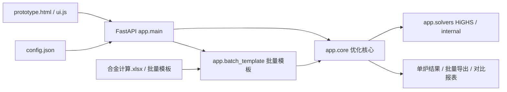
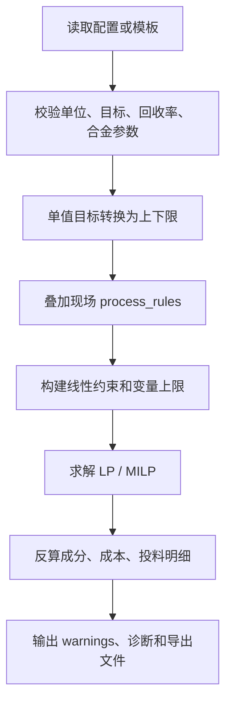

# 热卷合金成本优化工具

## 需求与目标

本项目用于热卷炼钢合金化成本优化：根据炼钢牌号、目标成分、转炉终点成分、回收率、合金成分和价格，计算满足成分约束下的低成本合金投料方案，并把旧 Excel 规则、LP 理论下限、现场可执行约束和批量模板流程统一到一个后端内核。

当前重点目标：

- 保留 `合金计算.xlsx` 作为旧规则取证和结果对比来源。
- 用后端 LP/MILP 算法替代旧 Excel 的逐列启发式公式。
- 把现场确认的新 LP 工艺规则集中到 `process_rules`，并支持页面配置。
- 批量 Excel 模板可预检、批量计算、导出结果。
- 对关键回算任务生成可审计 workbook，给出来源、结果、差异和原因。

## 开发环境

- 操作系统：Windows。
- Python：项目虚拟环境 `.venv-win`。
- 后端依赖：FastAPI、Pydantic、NumPy、SciPy/HiGHS、openpyxl。
- 前端：原生 HTML/CSS/JavaScript。
- 测试：pytest、Node.js `node --test`。

常用命令：

```powershell
.venv-win\Scripts\python.exe -m pytest -q
node --test tests/ui_static.test.js
.venv-win\Scripts\uvicorn.exe app.main:app --host 127.0.0.1 --port 8017
```

访问页面：

```text
http://127.0.0.1:8017/prototype.html
```

## 技术架构



核心数据流：



## 功能逻辑

### 单炉计算

用户在页面录入或调整目标成分、残余成分、合金价格、投料方式、回收率和现场工艺规则。后端返回：

- `rule`：系统生成的规则基线，只作为对照，不代表现场历史真实投料。
- `lp`：连续变量理论最低成本。
- `milp`：考虑整袋投料后的现场方案。

### 批量模板

批量模板包含任务、目标成分、转炉终点与回收率、合金成分库、价格表、填写说明。上传后先预检结构和数据，再逐任务调用同一个优化核心，最后导出结果。

### LP 新工艺规则

当前默认 `process_rules` 包括：

- C 按目标值扣 `0.005` 控制上限。
- Si 低目标时禁用硅锰/硅铁。
- 铝块按现场实际单独维护，不参与 LP 自动优化。
- Ti 目标叠加安全余量。
- Ni/Cu/Mo/Sb/B 低目标时不投对应纯合金。
- P/S 低目标时不投磷铁/硫铁。

### 合金计算 workbook 回算

脚本：

```powershell
.venv-win\Scripts\python.exe tools\recalculate_lp_actual_aluminum.py
```

输出：

```text
outputs/lp_actual_aluminum/合金计算_LP新算法_实际铝耗对比_修正版_20260613.xlsx
```

该脚本读取 `合金计算.xlsx` 的目标、终点、旧 Excel 投料和成本；读取 `副本4.铝耗分析(1).xlsx` 的 `铝耗!F` 炼钢牌号与 `铝耗!AF` 实际铝铝耗；按当前 LP 新算法重新计算非铝合金，再把实际铝耗单独计入新方案总耗和成本。若原 Excel 的 `AV/AW` 为 `#DIV/0!` 等错误值，该行只展示新 LP 结果和原因，不计算 `新-Excel` 差值，也不纳入有效可比汇总。

## 约束与注意事项

- Excel 旧表是“顺序启发式 + 经验阈值 + 缓存结果”，不是纯 LP。
- 对比 LP 时必须拆到合金投料、元素边界、回收率、铝耗口径和禁用规则，不能只看总成本。
- 铝耗用户口径里可能写成 `AP`，但当前 `副本4.铝耗分析(1).xlsx` 的实际表头在 `铝耗!AF1`，`AP` 不在使用范围内。
- `26MnB5` 的 Si 回收率若在原表为 0，按现场确认规则修正为 0.8。
- 修改算法、模板、页面或生成脚本后，必须同步更新本文档和 `issue_log.md`。
